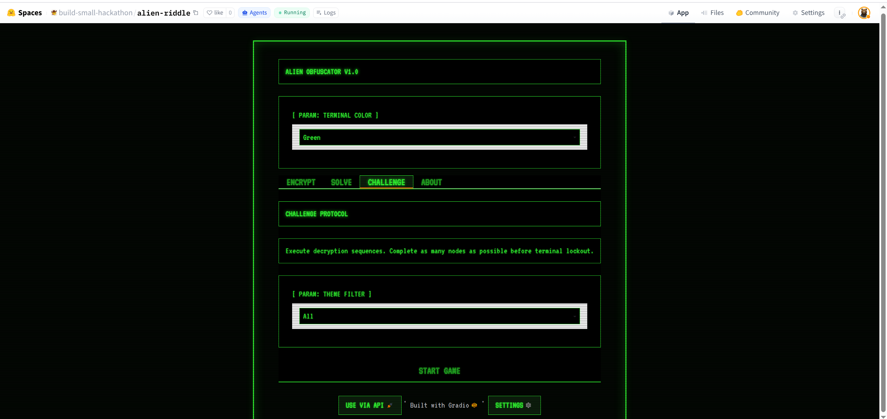

# Alien Obfuscator

An alien intelligence monitors all human communications. Resistance fighters encode messages as riddles drawn from ancient Earth texts — texts the alien cannot understand because they require *cultural context*, not decryption. The alien *sees* the riddle but can't *get* it. Humans can.

Built for the **HuggingFace Build Small Hackathon**.

[](smal-hack-hf2.mp4)

## How to Play

1. **Encrypt** — Type a secret message and pick a theme (Greek Myth, Shakespeare, Grimm, Poetry, Chinese Classics). The AI will generate a poetic riddle that only humans can solve.
2. **Solve** — Paste a friend's riddle card and guess the answer. Unlimited retries!
3. **Challenge** — Race against the clock to solve as many auto-generated riddles as you can.

## Architecture

- **Gradio** UI with dark sci-fi theming
- **Modular LLM backend** — Mock (offline), Hugging Face Inference API, or Modal (Gemma 4 on H200 GPU)
- **Corpus Manager** — Curated public-domain excerpts per theme
- **Riddle Generator** — Prompt builder + JSON schema validation + retry logic
- **Game Engine** — Timer, scoring, streaks, high-score persistence

## Parameter Budget

- Primary LLM: up to 31B parameters (`google/gemma-4-31b-it`)
- Fallback: `google/gemma-4-26b-a4b-it` (MoE)
- Total: ≤ 32B limit

## Project Structure

```
alien-obfuscator/
├── app.py                  # Gradio UI (tabs, layout, callbacks)
├── src/alien_obfuscator/
│   ├── config.py           # Constants, model settings, paths
│   ├── corpus_manager.py   # Loads, selects, caches excerpts
│   ├── modal_serve.py      # Modal vLLM server (Gemma 4 on H200)
│   └── riddle_generator.py # Prompt builder + LLM abstraction + validation
├── corpus/
│   ├── greek_myth.txt      # Curated excerpts
│   ├── shakespeare.txt
│   ├── grimm.txt
│   ├── poetry.txt
│   └── chinese_classics.txt
├── tests/
│   ├── test_corpus_manager.py
│   └── test_riddle_generator.py
├── requirements.txt
├── pyproject.toml
└── README.md
```

## Modal Deployment (Gemma 4 on GPU)

The app can optionally use a Modal-hosted vLLM server running `google/gemma-4-31b-it` on a single H200 GPU.

### Prerequisites

- Modal account (https://modal.com)
- Hugging Face token with access to Gemma 4 weights

### Setup

```bash
# Create Modal secrets
modal secret create hf-token HF_TOKEN=your_hf_token_here
```

Verify the config in `config.yaml` — the scaledown window controls idle auto-sleep:

```yaml
backends:
  modal:
    scaledown_window_minutes: 5   # auto-sleep after 5 min idle
```

### Deploy

```bash
# Deploy permanently (one-time setup)
make modal/deploy

# After deployment, check the URL — typically:
#   https://YOUR_WORKSPACE--modal-gemma-vllmserver-serve.modal.run
# Set it in .env:
#   MODAL_API_URL=https://YOUR_WORKSPACE--modal-gemma-vllmserver-serve.modal.run
```

### Managing the server

```bash
make modal/stop       # Stop all running containers
make modal/logs       # View recent logs
make modal/deploy     # Redeploy after changes
```

The server auto-sleeps after `scaledown_window_minutes` of idle and auto-wakes on the next request. You only pay for GPU time while processing.

## Running Locally

```bash
# Install dependencies
uv sync

# Run the app
make start

# Run tests
make test

# Lint & type-check
make lint
make ty
```

## License

This project uses public-domain texts and is provided as-is for the hackathon.
